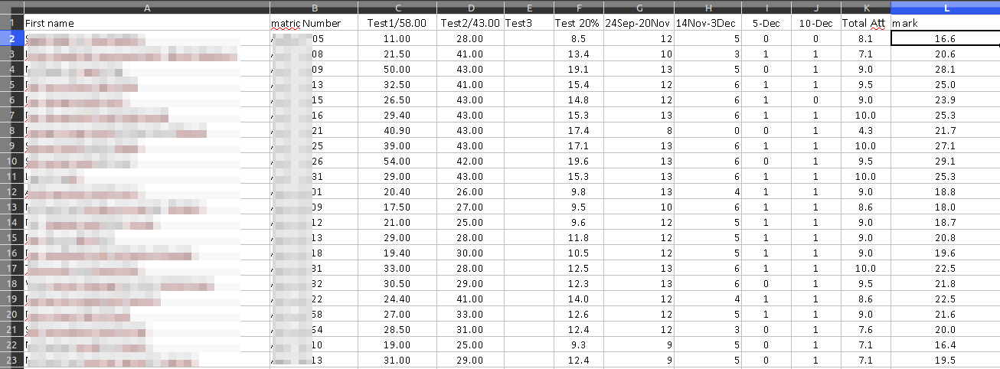
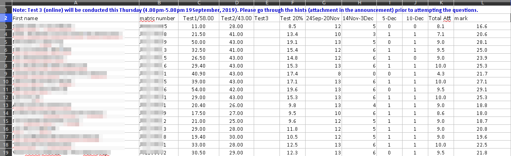
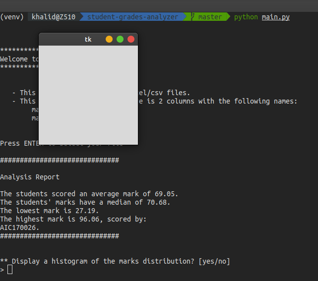
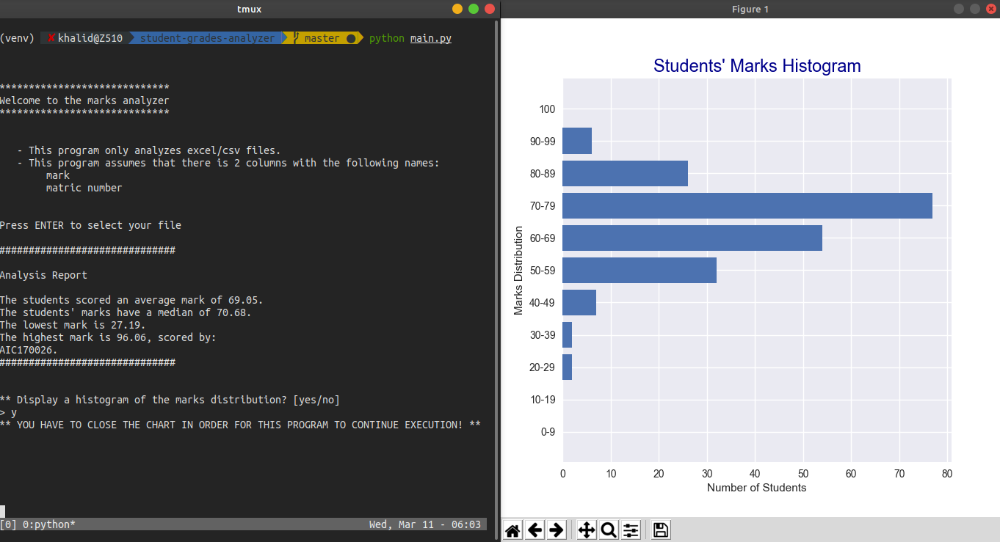

## Introduction and motivation.

During the last 2 years in my university, I realized that some of my friends are struggeling everytime a lecturer gives us our marks 
because my classmates will be going through large excel files just trying to 
compare their mark with the marks of
other students. Thus, I made this program to automate the process for my
classmates and my lecturers, as well.

## Getting started

### Preconditions
This is a very basic app written in Python3.8 that is capable of analyzing 
*csv*/*excel* files that obey the following conditions:
- The file has 2 columns at least with the names: `matric number` and `mark`.
- The file does NOT contain any lines before the column names (you can refer
  to the images below for further explanation).

### Installation
- Python version: 3.8.0
- You can clone or download this repository and then install the required
packages.
- The list of packages used in this app could be found in the requirements.txt
file and can be installed using pip.

### Using the app
Once you select your file, a short report will be printed on the screen.
The short report will contain the following information:
- The average (mean) score.
- The median score.
- The lowest mark.
- The highest mark.
- A list of students' matric numbers who scored the highest mark.

After that, you will be given the option to see a histogram illustrating the
marks distribution. Finally, after you close the chart and Tkinter window (if 
you do not know what I mean by the latter, do not worry, it is illustrated
below in pictures) you will be given the option to save the report above,
without the chart, to a text file.

## Illustrations

##### The program expects a file structure similar to this

---

##### It will NOT work with the following structure, _column names are NOT in the first line_

---

##### After you select and open your file, close the Tkinter window (the window in the picture below)

---

##### The histogram and the app running on the left side

## Connect with me
[LinkedIn](https://www.linkedin.com/in/khalidhamad/)
